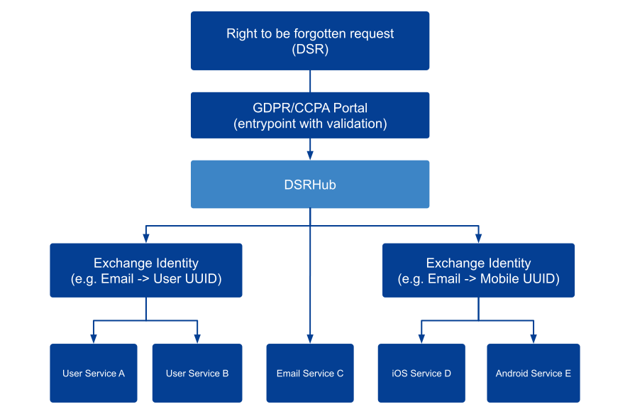
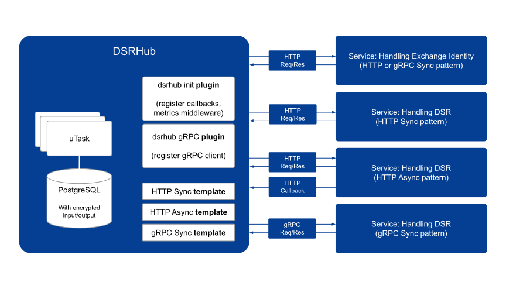

<a href="#">
    
</a>

<p align="center">
    <a href="https://goreportcard.com/report/github.com/dsrhub/dsrhub" target="_blank">
        
    </a>
    <a href="https://circleci.com/gh/dsrhub/dsrhub" target="_blank">
        
    </a>
    <a href="https://github.com/dsrhub/dsrhub/releases" target="_blank">
        
    </a>
    <a href="https://hub.docker.com/r/dsrhub/dsrhub/tags" target="_blank">
        
    </a>
</p>

# Introduction
DSRHub is an open platform for DSR (Data Subject Requests). It helps to orchestrate the workflow of privacy related compliance processes (e.g. GDPR/CCPA) among your microservices. 

DSRHub was built to ease the pain of managing microservices' data privacy related processes. The best practice of microservices is that data should be owned by the service. This adds complexity to managing personal identifiable information (PII) at scale, because usually the APIs of the microservices that handle the PII data are not standardized.

The goal of DSRHub is to extract the common logic of handling data subject requests within the microservices ecosystem into standard APIs and workflows. It ships a gRPC/swagger based API specification for your services and an YAML DSL workflow to orchestrate the data subject requests in a declarative manner.

# Features
Integration with the microservices.
- Standard gRPC/REST APIs with the support for identity resolution and DSR handling
- Standard YAML DSL based workflow definition
- Native support as a gRPC client to work with gRPC services
- Native support for OpenAPI/swagger client requests
- You own your data, 100%

Workflow orchestration (thanks to [uTask](https://github.com/ovh/utask)).
- Workflow orchestration
- Fault tolerance (retries, backoff)
- Encryption-at-rest for all the workflow's input/output
- Default 30 days (configurable) data retention TTL for max privacy protection 

# Quick start

## Run with docker-compose

```sh
$ git clone https://github.com/dsrhub/dsrhub.git
$ cd dsrhub
$ docker-compose up -f docker-compose.example.yaml
```

If you want to deploy dsrhub, please make sure the PostgreSQL database is up with the updated schema from `./sql/schema.sql`.

# Architecture

## High-level user experience



A typical workflow of a DSR (e.g. the right to be forgotten) is like the following:

1. User submit their DSR via a company's GDPR/CCPA portal (Web based or API based).
2. The GDPR/CCPA portal needs to understand and validate the user's identity. 
3. We can let dsrhub take care of the DSR based on the predefined DSR workflow.
4. (Optional) We can define dsrhub workflows with a step called "Exchange Identity" to enrich the context of an identity, which helps services that are not tied to the orignal identity format.
5. We then let individual services handle their own implementation of the dsrhub API specification. The services can expose gRPC or HTTP interfaces.
6. We can then get realtime information from dsrhub on the progress of the data subject requests.

## Internal implementation


Internally, dsrhub leverages uTask for workflow orchestration. On top of that, dsrhub extends utask with plugins and templates to support the privacy related processes. Moreover, you can still use the pure utask to define your own custom workflows.

To define your dsrhub YAML DSL, one can take a look at some of the examples stored in `./templates`. For example: 

```yaml
name: example-complex-dsrhub-workflow
title_format: 'example complex dsrhub workflow'
description: example complex dsrhub workflow
auto_runnable: true

inputs:
- name: email
  description: email
  default: zzzz@example.com

steps:
  start:
    description: start
    action:
      type: tag
      configuration:
        tags:
          email: '{{.input.email}}'

  example_grpc:
    description: send a grpc CreateDSR request
    action:
      type: dsrhub_grpc
      configuration:
        url: 'openmock:50051'
        request:
          regulation: 'gdpr'
          subject_request_id: '{{.task.resolution_id}}'
          subject_request_type: 'email'
          identity_value: '{{.input.email}}'

  email_service_a:
    description: send dsrhub request
    dependencies:
      - start
    action:
      type: subtask
      configuration:
        template: dsrhub_http_create_dsr_request
        input:
          url: 'http://openmock:9999/email-service-a/dsrhub/create_dsr_request'
          identity_type: email
          identity_value: '{{.input.email}}'
```

You can also try it locally with the dev version of the `./docker-compose.yaml`.

```sh
# Setup local dev version of docker-compose for dsrhub
$ git clone https://github.com/dsrhub/dsrhub.git
$ cd dsrhub
$ docker-compose up

# Test with a complex dsrhub workflow demo
# Note that a lot of microservices are mocked with OpenMock
# Default web login is admin:1234
$ open "http://localhost:8081/ui/dashboard/#/new"
```

# Config and Customization
WIP

# Metrics and Monitoring
WIP

# License
- [dsrhub/dsrhub](https://github.com/dsrhub/dsrhub): [Apache-2.0 License](https://github.com/dsrhub/dsrhub/blob/master/LICENSE)
- [ovh/utask](https://github.com/ovh/utask): [BSD 3-Clause License](https://github.com/ovh/utask/blob/master/LICENSE)

